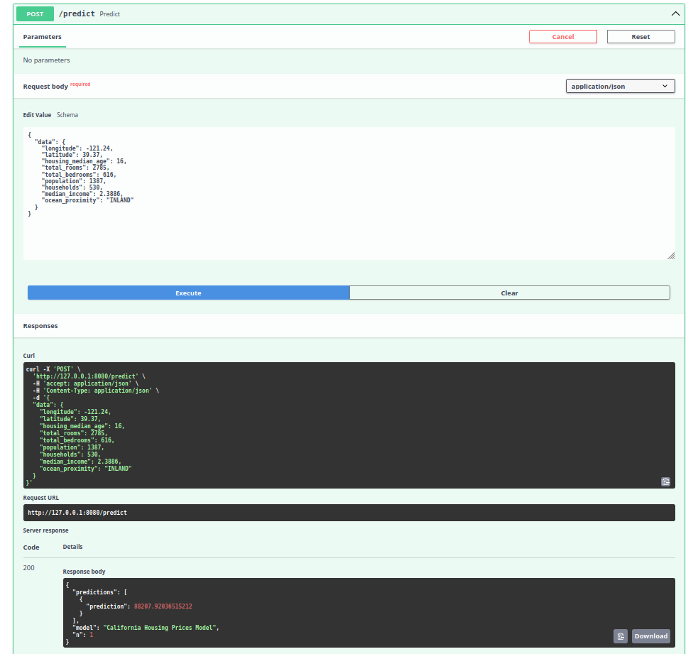
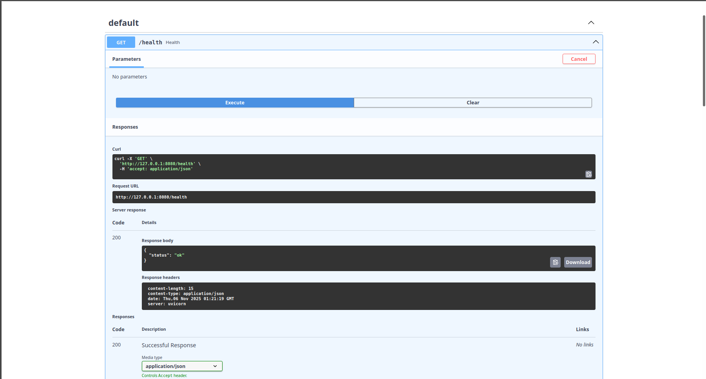

# Modelo de predicción del precio medio de viviendas en California

### Dataset reuperado de https://www.kaggle.com/datasets/camnugent/california-housing-prices

## Descripción General
Este proyecto implementa un modelo de aprendizaje automatico para predecir precios de viviendas del conjunto de datos California Housing Prices.  

El flujo completo incluye:
- Limpieza y preprocesamiento de datos  
- Entrenamiento y evaluación del modelo usando Random Forest  
- Creación de una API REST con FastAPI 
- Despliegue dentro de un contenedor Docker

El desarrollo y resultados del modelo puede ser consultado en  "Notebook de creacion del modelo/Modelo.ipynb".


## Estructura del Proyecto
```
servicio del modelo/
│
├── app/
│   ├── main.py               # API REST principal
│   ├── modelo.py             # Carga y predicción del modelo
│   ├── preprocesar.py        # Preprocesamiento e ingeniería de características
│   ├── esquemas.py           # Validación de entradas
│   ├── config.py             # Configuración de rutas
│   └── utils.py              # Logger
│
├── modelo/
│   └── modelo_California_housing_prices.pkl  # Modelo entrenado obtenido en el notebook
│
├── Dockerfile                # Configuración para contenerización
├── requirements.txt          # Dependencias del proyecto
```

## Ejecución con Docker

### Construir la imagen
Podemos crear la imagen desde el directorio "sevicio del modelo" que contiene el archivo Dockerfile:
```bash
docker build -t housing-api .
```

### Ejecutar el contenedor
Esto inicia el servidor en http://localhost:8000
```bash
docker run -p 8000:8000 housing-api
```

### Verificar
Sobre el navegador abrimos:
```
http://localhost:8000/docs
```

Allí podremos probar la API enviando los datos en formato JSON.


## Ejemplo de Consumo
Ejemplo del cuerpo JSON para probar la predicción:
```json
{
  "data": {
    "longitude": 0,
    "latitude": 0,
    "housing_median_age": 0,
    "total_rooms": 0,
    "total_bedrooms": 0,
    "population": 0,
    "households": 0,
    "median_income": 0,
    "ocean_proximity": "INLAND"
  }
}
```

La respuesta esperada es un valor numérico con el precio predicho:
```json
{
  "predictions": [
    {
      "prediction": 0
    }
  ],
  "model": "string",
  "n": 0
}
```
## Sobre la arquitectura de software y decisiones de diseño

El proyecto sigue una arquitectura cliente-servidor simple basada en un microservicio con FastAPI.  
El modelo de predicción de precios de vivienda fue desarrollado y entrenado previamente en un notebook donde se podemos ver los resultados obtenidos, y posteriormente se desplegó como una API REST dentro de un contenedor Docker.

La API expone un único endpoint `/predict` que recibe los valores de entrada del modelo  en formato JSON y devuelve la predicción del precio estimado.

- Se eligió FastAPI por su rapidez, validación automática de datos y documentación integrada en `/docs`.
- El modelo se serializó con joblib, permitiendo cargarlo rápidamente sin necesidad de reentrenar.
- El contenedor se configuro para escuchar en el puerto 8000.


## Imágenes de ejemplo 
**Respuesta de predicción:**



**Respuesta de estado:**




**Autor:** *José Juan González Fonseca*  